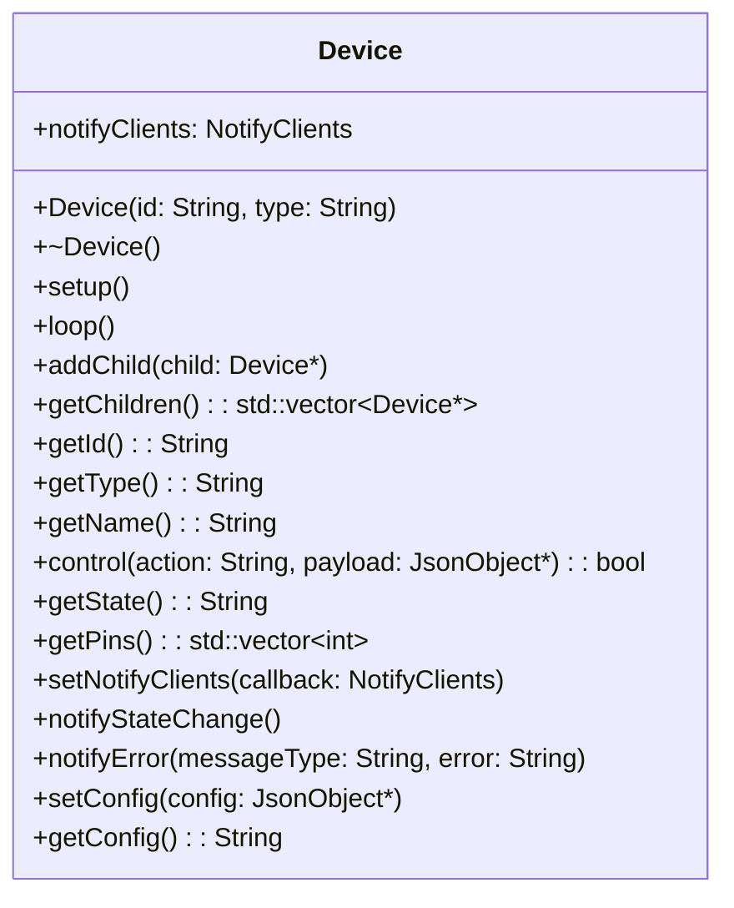

# Device Component Documentation

## Overview

The `Device` class serves as the base class for all devices in the Marble Track ESP32 firmware. It provides a common interface for device management, including identification, configuration, state management, and WebSocket-based communication. This abstract base class enables polymorphic device handling and hierarchical device structures through child device support.

## Key Features

- **Polymorphic Interface**: Abstract base class with virtual methods for consistent device behavior
- **Hierarchical Structure**: Support for child devices with recursive setup, loop, and state management
- **WebSocket Integration**: Built-in notification system for real-time state updates and error reporting
- **Configuration Management**: JSON-based configuration with get/set methods
- **Pin Management**: Virtual method for retrieving GPIO pin assignments
- **Identification**: Unique ID, type, and name properties for device identification

## Class Architecture



## Inheritance Hierarchy

The Device class is the root of the device hierarchy:

- `Device` (base class)
  - `Stepper` (stepper motor control)
  - `Wheel` (wheel device with stepper and sensor)
  - `Led` (LED control)
  - `Button` (button input)
  - `Buzzer` (audio output)
  - `Lift` (lifting mechanism)
  - `PwmMotor` (PWM motor control)
  - `Stepper` (stepper motor control)
  - `Wheel` (wheel mechanism)

## Core Methods

### Lifecycle Methods
- `setup()`: Initialize the device and its children
- `loop()`: Main update loop called repeatedly

### Control Interface
- `control(action, payload)`: Execute device-specific actions
- `getState()`: Return current device state as JSON
- `getConfig()`: Return device configuration as JSON
- `setConfig(config)`: Apply configuration from JSON

### Notification System
- `notifyClients`: send any WebSocket message
- `setNotifyClients(callback)`: caller the way to handle a WS message
- `notifyStateChange()`: Send state update via WebSocket
- `notifyError(type, error)`: Send error message via WebSocket

### Child Management
- `addChild(child)`: Add a child device
- `getChildren()`: Get list of child devices
- `getPins()`: Get all GPIO pins used by device and children

## Usage Examples

### Basic Device Creation
```cpp
class MyDevice : public Device {
public:
    MyDevice(const String &id) : Device(id, "mydevice") {}
    
    void setup() override {
        // Initialize hardware
        Device::setup(); // Setup children
    }
    
    void loop() override {
        // Update logic
        Device::loop(); // Update children
    }
    
    String getState() override {
        JsonDocument doc;
        doc["active"] = _isActive;
        // Add base state
        JsonDocument baseDoc;
        deserializeJson(baseDoc, Device::getState());
        for (JsonPair kv : baseDoc.as<JsonObject>()) {
            doc[kv.key()] = kv.value();
        }
        String result;
        serializeJson(doc, result);
        return result;
    }
};
```

### WebSocket Integration
```cpp
// Set notification callback
device.setNotifyClients([](const String &message) {
    // Send message via WebSocket
    webSocket.send(message);
});

// State changes automatically notify
device.notifyStateChange();

// Send custom error
device.notifyError("device-error", "Sensor failure");
```

### Hierarchical Setup
```cpp
Device *parent = new MyDevice("parent");
Device *child1 = new Stepper("stepper1");
Device *child2 = new Led("led1");

parent->addChild(child1);
parent->addChild(child2);

// Setup propagates to children
parent->setup();

// Loop propagates to children
parent->loop();
```

## State Management

Device state is represented as JSON strings. The base `getState()` method returns an empty object `{}`, but derived classes override it to include device-specific state information.

State changes trigger automatic WebSocket notifications when `notifyStateChange()` is called.

## Configuration

Configuration is handled via JSON objects. The base class provides empty implementations that derived classes override to support device-specific configuration parameters.

## Pin Management

The `getPins()` method returns a vector of GPIO pin numbers used by the device. The base implementation aggregates pins from all child devices, allowing hierarchical pin tracking.

## Thread Safety

The Device class is not inherently thread-safe. WebSocket notifications should be handled carefully in multi-threaded environments to avoid race conditions.</content>
  <parameter name="filePath">c:\repos\marble-track\esp32_ws\Device.MD
