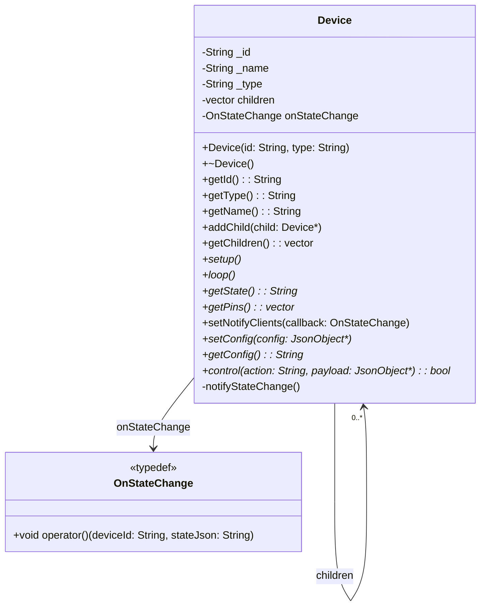

# Device Class Architecture

## Overview

The `Device` class serves as the base class for all devices in the Marble Track system. It provides a common interface for device management, state handling, and hierarchical device relationships.

## Class Diagram



## Key Components

### Core Properties

- **`_id`**: Unique identifier for the device
- **`_name`**: Human-readable name (can be empty)
- **`_type`**: Device type identifier (e.g., "led", "servo")
- **`children`**: Vector of child devices for hierarchical organization
- **`onStateChange`**: Function pointer for state change notifications

### Lifecycle Methods

- **`setup()`**: Virtual method called during device initialization
- **`loop()`**: Virtual method called repeatedly during device operation

### State Management

- **`getState()`**: Returns current device state as JSON string
- **`notifyStateChange()`**: Triggers state change callback when state updates
- **`setNotifyClients()`**: Registers callback for broadcasting messages

### Configuration

- **`getConfig()`**: Returns device configuration as JSON string
- **`setConfig()`**: Applies configuration from JSON object

### Control Interface

- **`control()`**: Processes control commands with optional JSON payload

### Device Hierarchy

- **`addChild()`**: Adds a child device to the hierarchy
- **`getChildren()`**: Returns list of child devices
- **`getPins()`**: Returns all pins used by device and its children

## Usage Patterns

### Basic Device Creation

```cpp
Device* myDevice = new MyDevice("device1", "mytype");
myDevice->setup();
```

### Hierarchical Device Management

```cpp
Device* parent = new ParentDevice("parent", "parent_type");
Device* child = new ChildDevice("child", "child_type");
parent->addChild(child);
```

## Implementation Notes

- The base `Device` class provides default implementations that derived classes can override
- Pure virtual methods are marked with `*` in the diagram but are actually virtual with default implementations
- The class uses Arduino's `String` class and ArduinoJson for JSON handling
- Memory management for child devices is handled by the parent device
- The callback mechanism enables reactive programming patterns for device state changes</content>
  <parameter name="filePath">c:\repos\marble-track\esp32_ws\Device.MD
