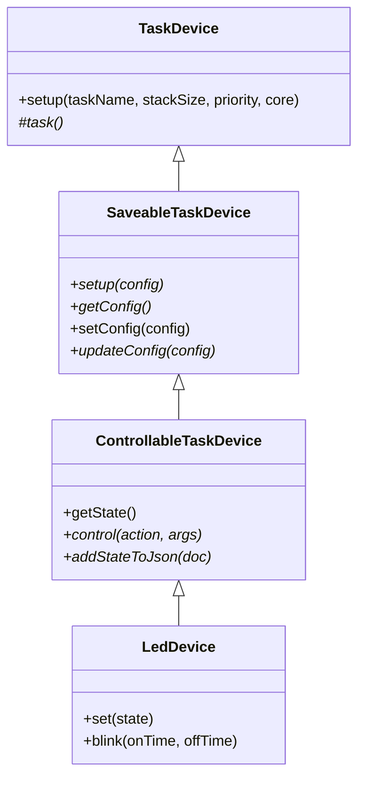

# Task Device Architecture

This diagram illustrates the inheritance hierarchy for task-based devices in the ESP32 firmware.

## Class Descriptions

### TaskDevice
The base class that manages the FreeRTOS task lifecycle. It handles task creation and provides the virtual `task()` method that derived classes must implement for their main loop.
- `setup(taskName, stackSize, priority, core)`: Creates and starts the FreeRTOS task on the specified core.
- `task()`: Protected virtual method containing the main loop. Derived classes must implement this to define the device's runtime behavior.

### SaveableTaskDevice
Extends `TaskDevice` to add configuration persistence.
- `setup(config)`: Initializes the device with a JSON configuration.
- `getConfig()`: Returns the current configuration.
- `setConfig(config)`: Updates the configuration, handling thread safety by suspending the task during updates.
- `updateConfig(config)`: Virtual method for subclasses to apply configuration changes.

### ControllableTaskDevice
Extends `SaveableTaskDevice` to add a standardized control interface.
- `getState()`: Returns the current state as a JSON string.
- `control(action, args)`: Accepts commands to modify the device state.
- `addStateToJson(doc)`: Virtual method for subclasses to inject their specific state data.

### LedDevice (Example Implementation)
A concrete implementation that controls an LED. It implements the `task()` loop to handle blinking or static states and overrides `addStateToJson` and `control` to expose its specific functionality.
