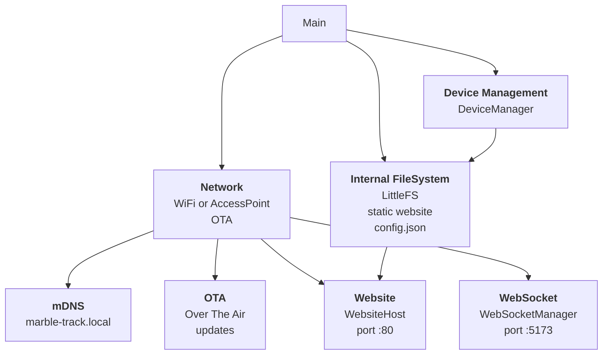

# ESP32_WS Application Architecture Overview

This diagram provides a high-level overview of the main components in the ESP32_WS firmware application.



## Network

## OTA

Over-the-Air (OTA) enables remote firmware updates for the ESP32 device. When OTA is initialized, the device listens for update requests over the network, allowing new firmware images to be uploaded and flashed without physical access. This streamlines maintenance and feature deployment, ensuring devices can be kept up-to-date securely and efficiently.

### Updating firmware with PlatformIO

1. Make sure the controller is connected to your WiFi network and reachable via mDNS (default hostname `marble-track.local`) or a known IP address.
2. Build the firmware once with `platformio run` to ensure the binary is up to date.
3. Trigger a wireless upload using PlatformIO's OTA environment:
    ```powershell
    platformio run -e 4d_systems_esp32s3_gen4_r8n16_ota --target upload --upload-port <device-host-or-ip>
    ```
    Replace `<device-host-or-ip>` with either `marble-track.local` or the device's IP address (for example `192.168.1.42`).
4. Wait for the upload to complete; the ESP32 automatically reboots and boots into the new firmware once flashing succeeds.

> Tip: pass `--upload-port` only when you need to override the default `marble-track.local` hostname specified in `platformio.ini`.

### mDNS

mDNS (Multicast DNS) allows the ESP32 device to advertise its hostname (`marble-track.local`) on the local network, enabling users to access the device via a human-friendly address instead of an IP. This simplifies device discovery and connection, especially in dynamic or non-static IP environments.

## LittleFS

LittleFS is a lightweight file system designed for embedded devices. On the ESP32_WS, it stores:

- static website assets
- configuration files (such as `config.json`).

This enables the firmware to serve the dashboard UI directly from onboard flash and persist device settings across reboots.
